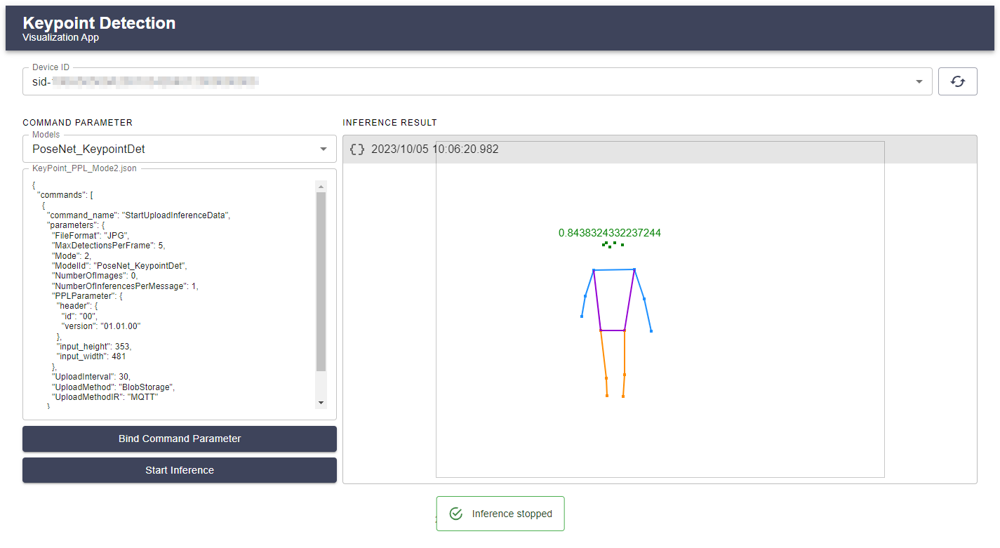
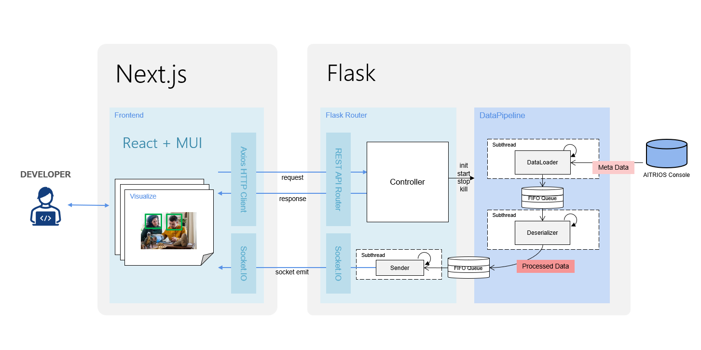

# Keypoint Detction: Sample Application on AITRIOS

## Contents

- [Overview](#overview)
- [Get Started](#get-started)
  - [Import and Deploy AI Model](#import-and-deploy-ai-model)
  - [Import and Deploy Vision and Sensing Application](#import-and-deploy-vision-and-sensing-application)
  - [Import and Bind Command Parameter File](#import-and-bind-command-parameter-file)
  - [Start application](#start-application)
- [Specification](#specification)
  - [Application stuck](#application-stuck)
  - [Functional overview](#functional-overview)
  - [Algorithm](#algorithm)
  - [Commands](#commands)
  - [Restrictions](#restrictions)
- [Get support](#get-support)
- [See also](#see-also)
- [Trademark](#trademark)
- [Notice](#notice)
- [Versioning](#versioning)
- [Branch](#branch)

## Overview

This repository provides sample code for [Flask](https://flask.palletsprojects.com/en/2.3.x/) backend application that controls **Console for AITRIOS** by using **Console REST API** and [Next.js](https://nextjs.org/) application that retrieves inference results from backend and display visualization in web browser, as well as configuration files for building a development environment. <br> 
This application retrieves Keypoint Detection AI model metadata from **Console for AITRIOS** and display pose estimation.



## Get Started

For basic device and console operation, please refer to the [**Device Setup Guide**](https://developer.aitrios.sony-semicon.com/en/edge-ai-sensing/documents/device-setup-guide/) and [**Console User Manual**](https://developer.aitrios.sony-semicon.com/en/edge-ai-sensing/documents/console-user-manual/).

### Import and Deploy AI Model

To import the AI model into **Console**, see tutorial in [import_model_to_console](./tutorial/import_model_to_console/README.md) directory. <br>
To deploy the imported model to the device, see **`3.4.1. Deploy registered AI model to device`** in [**Console User Manual**](https://developer.aitrios.sony-semicon.com/en/edge-ai-sensing/documents/console-user-manual/).

### Import and Deploy Vision and Sensing Application

To get metadata for keypoint detection from the device, deploy the Vision and Sensing application obtained from [download site](https://developer.aitrios.sony-semicon.com/downloads) to the device. <br>
See **`3.9.1. Manage Vision and Sensing Application`** for instructions on importing application into **Console**, and **`3.4.2. Deploy Vision and Sensing Application`** for instructions on deploying application to the device in [**Console User Manual**](https://developer.aitrios.sony-semicon.com/en/edge-ai-sensing/documents/console-user-manual/).

### Import and Bind Command Parameter File

To control the device's inference operation, Command Parameter must be bound to the device. <br>
See **`3.9.2. Manage Command Parameter file`** for instructions on importing Command Parameter file into **Console**, and **`3.3.4. Bind Command Parameter file to device`** for instructions on binding Command Parameter to the device in [**Console User Manual**](https://developer.aitrios.sony-semicon.com/en/edge-ai-sensing/documents/console-user-manual/).

The following is an example of minimum operable parameters. Save it as a JSON file of any name and import it into **Console** for use.

> **Note**
>
> - To reduce device processing delays, recommended to set the **"Mode"** parameter to **"2"** (output inference results only).
> - Set **"ModelID"** parameter to the model ID imported into **Console** above.

```JSON
{
  "commands": [
    {
      "command_name": "StartUploadInferenceData",
      "parameters": {
        "MaxDetectionsPerFrame": 5,
        "Mode": 2,
        "ModelId": "PoseNet_KeypointDet",
        "NumberOfInferencesPerMessage": 1,
        "PPLParameter": {
          "header": {
            "id": "00",
            "version": "01.01.00"
          },
          "input_height": 353,
          "input_width": 481
        },
        "UploadInterval": 30,
        "UploadMethodIR": "MQTT"
      }
    }
  ]
}
```

### Start application

#### Start application on Github Codespaces

1. Clone or fork this application in your GitHub environment.
2. Click the `+` button to create a codespace on the GitHub environment. See [how to create a codespace](https://docs.github.com/en/codespaces/developing-in-codespaces/creating-a-codespace-for-a-repository).
3. Create console access setting configuration file with real values in [backend/src/config/console_access_settings.yaml](./backend/src/config/console_access_settings.yaml.sample).

    `backend/src/config/console_access_settings.yaml`

    ```yaml
    console_access_settings:
        console_endpoint: "__console_endpoint__"
        portal_authorization_endpoint: "__portal_authorization_endpoint__"
        client_secret: "__client_secret__"
        client_id: "__client_id__"
    ```

    > **Note**
    >
    > - Specify the base URL
    > - Specify the token URL
    > - Specify registered application secret for client_secret
    > - Specify registered application client ID for client_id
    >
    > To obtain the endpoint URL, see [REST API Authentication](https://developer.aitrios.sony-semicon.com/en/file/download/edge-ai-sensing-portal-console-end-point-info/), or
    see the [Portal user manual](https://developer.aitrios.sony-semicon.com/en/edge-ai-sensing/documents/portal-user-manual/) for more details.

    > **Warning**
    >
    > The above config file is referenced by specifying the path in [backend/src/app.py](./backend/src/app.py) and [backend/src/pipeline/data_loader/console_data_loader.py](./backend/src/pipeline/data_loader/console_data_loader.py). If you change the path to the config file, you must also change the paths specified in these files.
    >
    > `backend/src/app.py`
    >
    > ```python
    > 28 # Load Console access settings
    > 29 with open(os.path.join(os.getcwd(), "src", "config", "console_access_settings.yaml")) as file:
    > ```
    >
    > `backend/src/pipeline/data_loader/console_data_loader.py`
    >
    > ```python
    > 26 with open(
    > 27     os.path.join(
    > 28         os.path.dirname(__file__), "..", "..", "config", "console_access_settings.yaml"
    > 29     ) 
    > ```
    >
4. Run the sample application using the following command.

    ```sh
    vscode ➜ /workspace/aitrios-application_keypoint-detection (main) $ docker compose up
    # or run apps in the background
    vscode ➜ /workspace/aitrios-application_keypoint-detection (main) $ docker compose up -d
    ```

    > **Note**
    >
    > To make this app fully operational, set the Port Visibility setting of the backend app to public as follows.
    >
    > 1. Click the `PORTS` tab in your Codespace.
    > 2. Right-click the port of the backend app(`5000` by default), click the `Port Visibility`.
    > 3. Change value Private to Public.
    >
    > See the [Github Codespace documentation](https://docs.github.com/en/codespaces/developing-in-codespaces/forwarding-ports-in-your-codespace#sharing-a-port) for more infomations.
5. Access the host address from the pop-up in the lower right corner, and verify that the application is running.

#### Start application on local Docker environment(DevContainer)

1. Open the cloned repository from VSCode's "Open Folder" in "File" tab
2. Open Command Palette in VSCode(Ctrl + Shift + P)
3. Type and choose `"Dev Containers: Open Folder in Container..."`
4. Select root directory of the project and wait for building DevContainer.

    ```sh
    /your/local/workspace/aitrios-application_keypoint-detection
    ```

5. Create console access setting configuration file with real values in [backend/src/config/console_access_settings.yaml](./backend/src/config/console_access_settings.yaml.sample).

    `backend/src/config/console_access_settings.yaml`

    ```yaml
    console_access_settings:
        console_endpoint: "__console_endpoint__"
        portal_authorization_endpoint: "__portal_authorization_endpoint__"
        client_secret: "__client_secret__"
        client_id: "__client_id__"
    ```

    > **Note**
    >
    > - Specify the base URL
    > - Specify the token URL
    > - Specify registered application secret for client_secret
    > - Specify registered application client ID for client_id
    >
    > To obtain the endpoint URL, see [REST API Authentication](https://developer.aitrios.sony-semicon.com/en/file/download/edge-ai-sensing-portal-console-end-point-info/), or
    see the [Portal user manual](https://developer.aitrios.sony-semicon.com/en/edge-ai-sensing/documents/portal-user-manual/) for more details.

    > **Warning**
    >
    > The above config file is referenced by specifying the path in [backend/src/app.py](./backend/src/app.py) and [backend/src/pipeline/data_loader/console_data_loader.py](./backend/src/pipeline/data_loader/console_data_loader.py). If you change the path to the config file, you must also change the paths specified in these files.
    >
    > `backend/src/app.py`
    >
    > ```python
    > 28 # Load Console access settings
    > 29 with open(os.path.join(os.getcwd(), "src", "config", "console_access_settings.yaml")) as file:
    > ```
    >
    > `backend/src/pipeline/data_loader/console_data_loader.py`
    >
    > ```python
    > 26 with open(
    > 27     os.path.join(
    > 28         os.path.dirname(__file__), "..", "..", "config", "console_access_settings.yaml"
    > 29     ) 
    > ```
    >
6. Run the sample application using the following command.

    ```sh
    vscode ➜ /workspace/aitrios-application_keypoint-detection (main) $ docker compose up
    # or run apps in the background
    vscode ➜ /workspace/aitrios-application_keypoint-detection (main) $ docker compose up -d
    ```

7. Open `localhost:3000` in a browser and verify that the application is running.

## Specification

### Application stuck



| Package | Version | Description |
|---------|---------|-------------|
| `Node.js` | `v18`| Cross-platform JavaScript runtime environment and library for running web applications. |
| `TypeScript` | `^4.9.5` | Syntactic superset of JavaScript which adds static typing. |
| `Next.js` | `13.1.6` | React-based web application development framework with server-side rendering and static website generation. |
| `React` | `18.2.0` | Front-end JavaScript library for building user interfaces based on components. |
| `MUI` | `^5.11.10` | Library of UI design components that developers can easily import to build React applications. |
| `Python` | `^3.9` | Interpreted, object-oriented, high-level programming language with dynamic semantics. |
| `Flask` | `^2.3.2` | Micro web framework written in Python. |
| `Flatbuffers` | `1.11.0` | Cross platform serialization library for various languages. |
| [Console REST API](https://developer.aitrios.sony-semicon.com/en/edge-ai-sensing/guides/) | - | REST APIs that provides accesses and controls of the **Console for AITRIOS**. |

### Functional overview

- Inference result viewer
  - A list of edge AI devices connected to the Console is displayed on the screen.
  - A list of AI models deployed on the specified device is displayed on the screen.
  - A text filed that display Command Parameter binded on the specified device on the screen.
  - A button that updates and binds Command Parameter to the specified device.
  - A button that that controlls uploading Inference Results of the specified device.
- To run this app properly, deploy PoseNet AI model and Keypoint Detection PPL to the device.
- It can be run on Dev Containers/GitHub Codespaces.

### Algorithm

#### 1. Device selector

1. When the page is first opened, the **GetDevices API** is called to get the DeviceID list of edge AI devices registered in the Console.
2. The gotten Device ID list of edge AI devices is set to the **Device selector** drop-down list.
3. Choose Device ID of purpose from the **Device selector** drop-down list.

#### 2. Command Parameter field

1. When a Device ID is selected, the **GetCommandParameters API** is called to get the info of Command Parameters registerd in the Console.
2. Search for Command Parameter bound to a specific device from the info of Command Parameters.
3. Binded Command Parameter is displayed in JSON format in the Text Field on the sidebar of the screen.
4. Parameters in Command Parameter can be changed to any value.

#### 3. AI model selector

1. When a Device ID is selected, the **GetDevice API** is called to get a list of AI models deployed to the certain device.
2. The gotten AI model list of certain device is set to the **AI model selector** list on the sidebar.
3. The default value of the selector is set to the AI model set in the ModelID key of the Command Parameter obtained in the **Command Parameter field**.
4. Selecting an AI model from the selector will change the ModelID in the **Command Parameter field**.

#### 4. Bind Command Parameter button

1. When the button is pressed, the **UpdateCommandParameter API** is called to update the Command Parameter currently bound to the device with the contents of the Command Parameter field. At this time, the contents of the registered Command Parameter File are overwritten.
2. If the update is successful, a notification alert will be displayed.

#### 5. Start Inference button

1. When the button is pressed, the **StartUploadInferenceResult API** is called and the device starts uploading the inference results.
2. When the device starts inference, subthreads are started in the backend that loops to retrieve the latest inference result and deserialize them.
3. If the start sequence is successful, a notification alert will be displayed. The button label changes to **Stop Inference** while inference is running.
4. If you press the button again while inference is running, the **StopUploadInferenceResult API** will be called and upload from the device will stop.
5. Stop subthreads that is retrieving and deserializing inference results.
6. If the stop sequence is successful, a notification alert will be displayed.

#### 6. Inference result viewer

1. While inference is running, a subthread loops to retrieve the latest inference result from the Console by calling **GetInferenceResult API**.
2. Decode the obtained inference result in base64 and deserialize it in Flatbuffers. You can obtain the keypoint coordinates of human pose estimation as follows.

    ```JSON
    {
        "score": 0.916876,
        "keypoint_list": [
            {
                "point": {
                    "x": 175,
                    "y": 91
                },
                "name": "Nose"
            },
            {
                "point": {
                    "x": 181,
                    "y": 87
                },
                "name": "LeftEye"
            },
        ]
    }
    ```

3. Based on the keypoint coordinates infomation, a pose estimation is drawn on the window of the **Inference result viewer**.
4. By pressing the icon button in the upper left corner of the window, you can view the inference results in JSON format.

### Commands

#### **docker compose**

Using the `Docker in Docker` technique, start the frontend and backend apps in the DevContainer according to the description in `docker-compose.yaml`. <br>
Following commands can be executed in the root directory.

`docker compose up`

Starts the frontend and backend apps as containers. In the container, start the dev server according to the `npm run dev` and `flask run` commands, respectively.

- `docker compose up -d` - Starts the containers in the background and leaves them running.

`docker compose down`

Stops containers and removes containers, networks, volumes, and images created by `docker compose up`.

#### **Frontend**

Following commands can be executed in the `/frontend` directory.

`npm install`

Installs locally the dependent packages listed in `package.json` that exist in the current directory. When using DevContainer or Codespaces, this is done automatically at container startup.

`npm run dev`

Starts the development server for the `Next.js` application. By default, the app is hosted on port 3000.

`npm run lint`

Runs the static analysis tool `ESlint` to detect code with execution problems. See `.eslintrc.json` for detection rule definitions.

- `npm run lint:fix` - Automatically fix any detected codes that can be done automatically.

`npm run fmt`

Runs the automatic formatting tool `Prettier` to perform automatic formatting of codes based on coding rules. See `.prettierrc.json` for formatting rule definitions.

#### **Backend**

Following commands can be executed in the `/backend` directory.

`flask run`

Starts the development server for the `Flask` application. By default, the app is hosted on port 5000.

`python -m pflake8` {source_file_or_directory}

Runs the static analysis tool `flake8` to detect code with execution problems. The `pflake8` is PEP 8 compliant linter.

`python -m black` {source_file_or_directory}

Runs the automatic formatting tool `black` to perform automatic code formatting. The `black` is PEP 8 compliant formatter.

### Restrictions

Since some APIs are not provided in the `ConsoleAccessLibrary`, an HTTP client defined in OpenAPI is used to access the **Console for AITRIOS** instead.

## Get support

- [Contact us](https://developer.aitrios.sony-semicon.com/en/edge-ai-sensing/contact-us/)

## See also

- [Get Started](https://developer.aitrios.sony-semicon.com/en/edge-ai-sensing/guides/)
- [Console REST API reference](https://developer.aitrios.sony-semicon.com/en/edge-ai-sensing/guides/)
- [aitrios-sdk-console-access-lib-python](https://github.com/SonySemiconductorSolutions/aitrios-sdk-console-access-lib-python)
- [aitrios-sdk-cloud-app-sample-python](https://github.com/SonySemiconductorSolutions/aitrios-sdk-cloud-app-sample-python)

## Trademark

- [Read This First](https://developer.aitrios.sony-semicon.com/en/documents/read-this-first)

## Notice

### Security

Before using Codespaces, please read the Site Policy of GitHub and understand the usage conditions.

## Versioning

This library aims to adhere to Semantic Versioning 2.0.0.

## Branch

See the Release Note from Releases for this repository.

Each release is generated in the main branch. Pre-releases are generated in the develop branch. Releases will not be provided by other branches.
